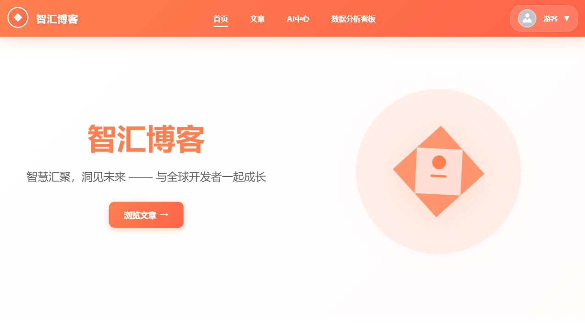

# Vue-blog

Vue 博客前端项目，包含文章入口、AI 中心、数据分析看板、个人中心和性能示例页面。它适合用于学习 Vue 前端应用结构、内容型应用页面组织和 AI center dashboard 的基础实现方式。

- 项目介绍：https://linsk27.github.io/projects/vue-blog/
- 线上演示：https://vue-blog-smoky.vercel.app/
- GitHub 仓库：https://github.com/linsk27/Vue-blog
- 作者主页：https://github.com/linsk27



## 项目定位

Vue-blog 是一个个人开发的博客前端项目。它不只是简单文章列表，还包含 AI 中心、数据分析看板、性能示例、文章编辑和个人资料等页面，用来练习 Vue、Element Plus、Pinia、Vue Router、API 模块拆分和内容展示类应用结构。

## 功能方向

- 博客文章入口与内容展示。
- AI 中心页面与对话相关界面。
- 数据分析 dashboard。
- 登录、个人中心和权限相关页面。
- 图片压缩、虚拟列表、KeepAlive 等性能示例。

## 技术栈

- Vue
- TypeScript
- Vite
- Element Plus
- Pinia
- Vue Router
- Axios

## 运行方式

```bash
npm install
npm run dev
```

## 项目入口

- 项目介绍：[Vue-blog 项目页](https://linsk27.github.io/projects/vue-blog/)
- 线上演示：[vue-blog-smoky.vercel.app](https://vue-blog-smoky.vercel.app/)
- GitHub 仓库：[linsk27/Vue-blog](https://github.com/linsk27/Vue-blog)

如果这个 Vue 博客项目对你有参考价值，欢迎点 Star。Star 是我继续完善页面结构、文档和可复用组件示例的主要信号。
